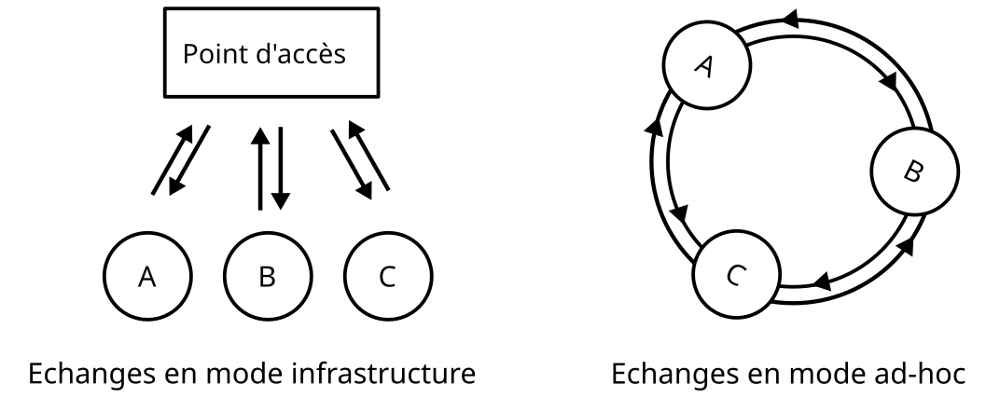

### Positionnements thématiques et mots-clés
---
**Positionnements thématiques**:
- Informatique pratique
- Technologies informatiques

**Mots clés**

| Français  | Anglais |
| --------- | ------- |
| *à finir* |         |

**Idées**:
Réseaux ad-hoc (MANETs)
AODV routing
Économie d'énergie
Optimisation
Simulation
 

### Bibliographie commentée
---
Parfois les infrastructures nécessaires pour faire fonctionner un réseau d'appareil en passant par des points relais afin de faire communiquer les appareils indirectement sont absentes. C'est le cas lors de situations d'urgence (des catastrophes naturelles par exemple). La solution prépondérante pour palier à ce manque est la mise en place d'un réseau *ad-hoc*. Ceci consiste à faire communiquer les appareils directement entre eux au lieu de passer par un ou plusieurs point relais centraux. 
(https://commons.wikimedia.org/wiki/File:Ad-Hoc.svg)
Parmi les deux principaux types de protocoles permettant de mettre en place de tels réseaux, je m'intéresserai ici aux protocoles dits *réactifs* ou *à la demande*, qui établissent une route (une suite de noeuds qui vont transmettre le message) entre deux noeuds seulement quand cette dernière est requise. Plus particulièrement au protocole de routage AODV (Ad-hoc On-demand Distance Vector) dans le cas de petits réseaux d'appareils mobiles tels que des radios ou des caméras piétons. 
Ce protocole, décrit dans les années 2000 par C. Perkins \[1\] est un des plus utilisés aujourd'hui dans cette catégorie et un des plus efficaces en termes de consommation énergétique \[2\], ce qui a motivé le choix de ce protocole.
Cependant, pour choisir une route, il ne prend en compte que le nombre de sauts c'est à dire de noeuds empruntés sur le chemin, qu'il cherche à minimiser. Cela tend à surcharger certains noeuds ce qui vide plus rapidement leur batterie, diminuant potentiellement la durée de vie du réseau et/ou sa connectivité. \[3\] 
De nombreuses 

### Références bibliographiques
---
\[1\] *Ad hoc On-Demand Distance Vector (AODV) Routing*, C. Perkins (Norme RFC 356), Juillet 2003 (http://www.rfc.fr/rfc/en/rfc3561.pdf)

\[2\] Network Lifetime Analysis of AODV, DSR and ZRP at Different Network Parameters Juillet 2012(https://arxiv.org/abs/1207.2584)

\[3\] AODV-EOCW: An Energy-Optimized Combined Weighting AODV Protocol for Mobile Ad Hoc Networks(https://www.mdpi.com/1424-8220/23/15/6759#B8-sensors-23-06759)
